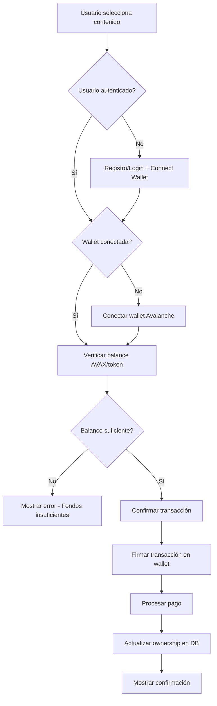
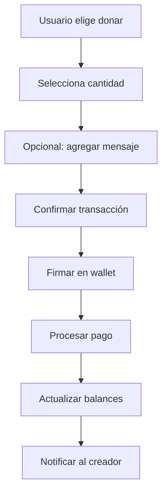

# AvalCreator: Flujo de Inversión/Donación para Usuario No Creador

## Flujo Conceptual

### 1. Usuario llega a la plataforma

1. Usuario navega el marketplace
2. Encuentra un contenido/creador de interés
3. Decide invertir/comprar/donar

### 2. Autenticación

- Si no está logueado, debe registrarse o iniciar sesión
- Conectar wallet (MetaMask, WalletConnect, etc.)

### 3. Flujo de Compra/Inversión/Donación

#### A. Para Contenido (NFT/Digital)



#### B. Para Donación



## Flujo Técnico Detallado

### 1. Componentes Frontend

```typescript
// Ejemplo de estructura de componente React
interface PurchaseComponentProps {
  contentId: string;
  creatorId: string;
  price: string;
  type: 'content' | 'donation';
}

// Estado del componente
const [walletAddress, setWalletAddress] = useState<string>('');
const [isLoading, setIsLoading] = useState<boolean>(false);
const [error, setError] = useState<string>('');
```

### 2. Flujo de Autenticación

#### A. Registro/Login

```typescript
// API Call para registro
POST /api/auth/register
Body: {
  email: string,
  password: string,
  walletAddress?: string
}

// API Call para login
POST /api/auth/login
Body: {
  email: string,
  password: string
}
```

#### B. Conectar Wallet

```typescript
// 1. Solicitar mensaje para firmar
GET /api/auth/wallet-message

// 2. Firmar mensaje con wallet
const message = await response.json();
const signature = await wallet.signMessage(message);

// 3. Verificar firma y conectar wallet
POST /api/auth/connect-wallet
Body: {
  walletAddress: string,
  signature: string,
  message: string
}
```

### 3. Verificación de Balance

```typescript
// Verificar balance on-chain
const balance = await provider.getBalance(userAddress);
const tokenBalance = await tokenContract.balanceOf(userAddress);

// Verificar balance interno
GET /api/tokens/balance
Headers: {
  Authorization: 'Bearer JWT_TOKEN'
}
```

### 4. Flujo de Compra/Inversión

#### A. Para Contenido NFT

```typescript
// 1. Obtener detalles del contenido
GET /api/content/:id

// 2. Confirmar compra
POST /api/content/:id/purchase
Headers: {
  Authorization: 'Bearer JWT_TOKEN'
}
Body: {
  paymentMethod: 'crypto',
  walletAddress: string
}

// 3. Realizar transacción on-chain
const tx = await contract.purchaseContent(
  contentId,
  creatorAddress,
  price,
  { value: price }
);

// 4. Confirmar transacción
PATCH /api/payments/:id/status
Body: {
  transactionHash: string,
  status: 'completed'
}
```

#### B. Para Donación

```typescript
// 1. Crear intención de pago
POST /api/payments
Body: {
  type: 'donation',
  toUserId: string,
  amount: string,
  message?: string
}

// 2. Realizar transferencia
const tx = await wallet.sendTransaction({
  to: creatorAddress,
  value: ethers.utils.parseEther(amount)
});

// 3. Confirmar pago
PATCH /api/payments/:id/status
Body: {
  transactionHash: string,
  status: 'completed'
}
```

### 5. Actualización de Estados

```typescript
// Actualizar balances internos
PUT /api/tokens/balance
Body: {
  amount: string,
  operation: 'subtract' | 'add'
}

// Actualizar ownership de contenido
PATCH /api/content/:id/ownership
Body: {
  newOwnerId: string
}
```

## Consideraciones de UX

### 1. Estados de la Transacción

- **Iniciando**: Preparando datos
- **Firmando**: Usuario firmando en wallet
- **Procesando**: Transacción en blockchain
- **Completado**: Exitoso
- **Error**: Manejo de errores

### 2. Manejo de Errores

```typescript
const errorMessages = {
  'insufficient_funds': 'Fondos insuficientes',
  'wallet_not_connected': 'Wallet no conectada',
  'transaction_failed': 'Transacción fallida',
  'user_rejected': 'Transacción cancelada',
  'network_error': 'Error de red'
};
```

### 3. Confirmaciones

- Mostrar confirmación visual
- Notificación al creador
- Actualización de UI en tiempo real

## Integración con Avalanche

### 1. Contract Setup

```typescript
// Configuración de contrato
const contract = new ethers.Contract(
  CONTRACT_ADDRESS,
  ABI,
  provider
);
```

### 2. Network Configuration

```typescript
const avalancheNetwork = {
  chainId: '0xA86A', // Avalanche C-Chain
  chainName: 'Avalanche Network',
  nativeCurrency: {
    name: 'AVAX',
    symbol: 'AVAX',
    decimals: 18
  },
  rpcUrls: ['https://api.avax.network/ext/bc/C/rpc'],
  blockExplorerUrls: ['https://snowtrace.io/']
};
```

## Flujo Completo en Código

```typescript
// Ejemplo simplificado de flujo completo
async function purchaseContent(contentId: string) {
  try {
    // 1. Verificar autenticación
    const token = localStorage.getItem('token');
    if (!token) await authFlow();
    
    // 2. Obtener info del contenido
    const content = await fetchContent(contentId);
    
    // 3. Verificar wallet
    const wallet = await connectWallet();
    
    // 4. Verificar balance
    const hasBalance = await checkBalance(content.price);
    if (!hasBalance) throw new Error('insufficient_funds');
    
    // 5. Crear intención de pago
    const payment = await createPaymentIntent(contentId);
    
    // 6. Ejecutar transacción
    const tx = await executeTransaction(payment);
    
    // 7. Confirmar pago
    await confirmPayment(payment.id, tx.hash);
    
    // 8. Actualizar UI
    showSuccess('Compra exitosa!');
    
  } catch (error) {
    handleError(error);
  }
}
```

## Próximos Pasos de Implementación

1. **Implementar endpoints de payments**
   - Crear intenciones de pago
   - Confirmar transacciones
   - Obtener historial

2. **Integrar con Avalanche**
   - Configurar Web3 provider
   - Implementar funciones de contrato
   - Manejar eventos de blockchain

3. **Crear componentes de UI**
   - Modal de compra
   - Estado de transacción
   - Manejo de errores

4. **Testing end-to-end**
   - Flujos de compra
   - Manejo de errores
   - Integración con testnet

## Consideraciones de Seguridad

1. **Validación on-chain**
   - Verificar ownership
   - Validar transacciones
   - Prevenir ataques de replay

2. **Manejo de claves**
   - Nunca almacenar claves privadas
   - Usar wallets externas
   - Firmar solo lo necesario

3. **Rate limiting**
   - Proteger endpoints sensibles
   - Prevenir spam
   - Monitorear patrones anómalos

Este flujo proporciona una base sólida para implementar la funcionalidad de compra/inversión/donación en tu plataforma AvalCreator.
